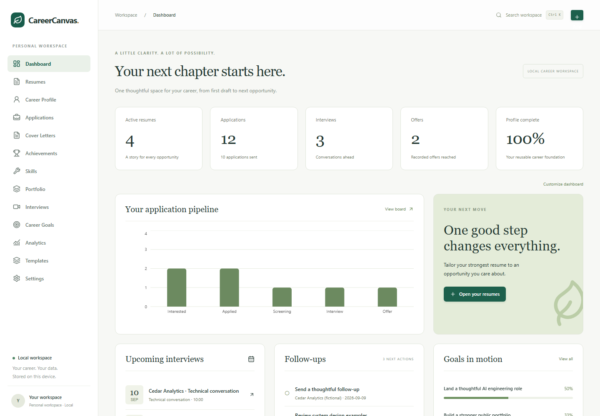
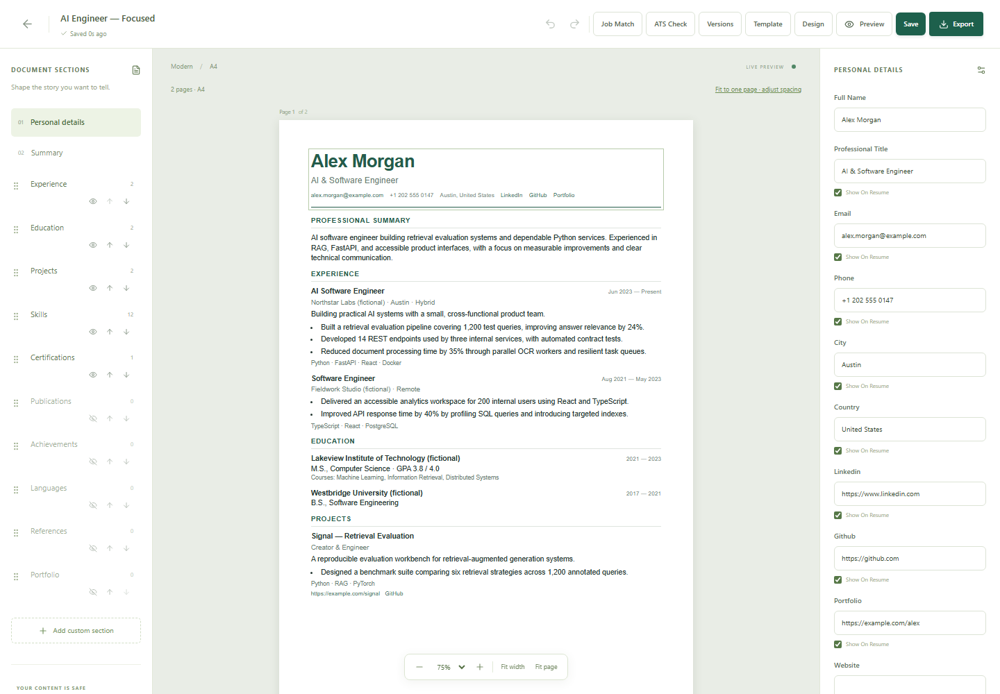
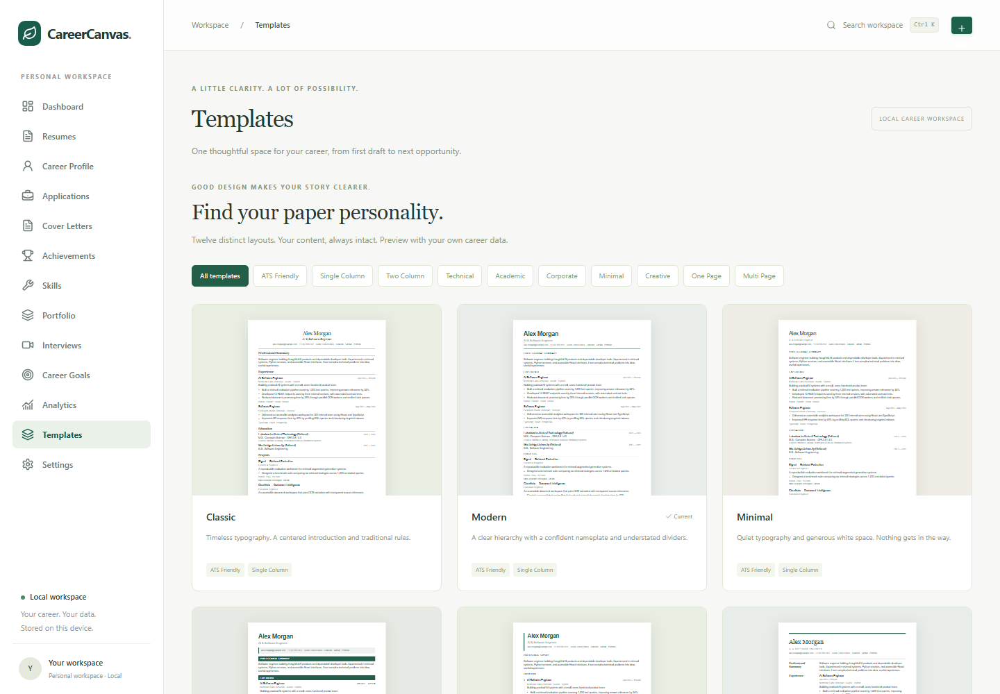
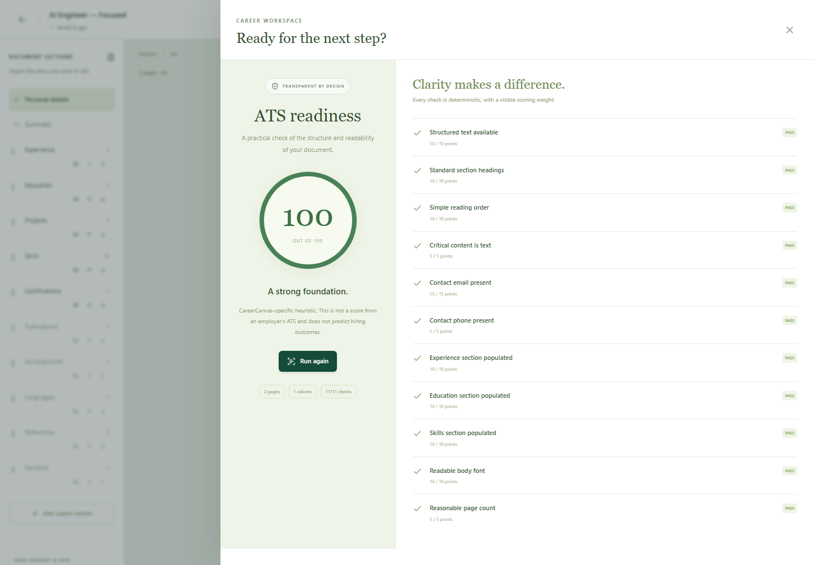
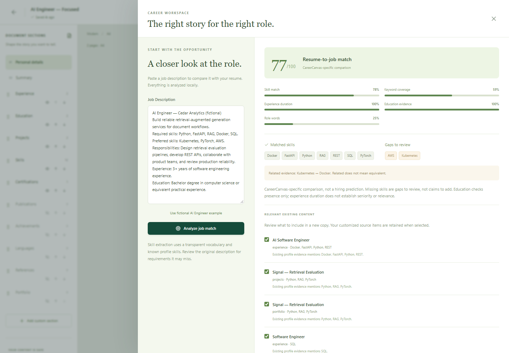
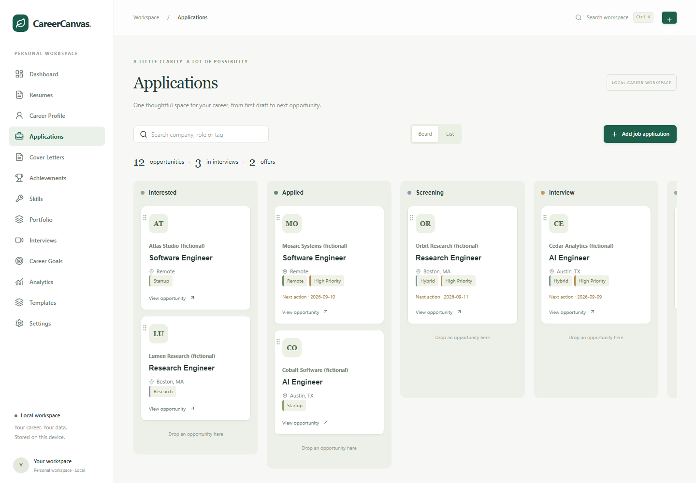

# CareerCanvas

**One career profile. Many tailored resumes. A local workspace for the full job-search lifecycle.**

CareerCanvas is an MIT-licensed, local-first resume editor and career management application. It combines a visual resume builder, reusable career profile, resume import, strict ATS-readiness review, job tailoring, application tracking, interview preparation, and career analytics.



## What CareerCanvas does

Store experience, education, skills, projects, achievements, certifications, publications, and portfolio evidence once. Then create independent resumes that select and customize different parts of that profile. Editing one resume never rewrites the Career Profile or another resume.

CareerCanvas currently includes **13 workspace areas**, **12 resume templates**, and **80 documented capability groups**. The complete inventory is in [Features](docs/FEATURES.md).

## Main workflows

### Build or import a Career Profile

Create career records manually, or use **Import Resume** to process an existing PDF, DOCX, or TXT resume locally. CareerCanvas detects common sections, proposes structured fields, shows confidence and source evidence, detects likely duplicates, and requires review before writing anything.

Duplicate choices are explicit:

- Keep existing
- Merge missing/list data
- Replace existing
- Import as new

See [Resume Import & Direct ATS Review](docs/RESUME_IMPORT.md).

### Build and edit resumes



The three-panel editor keeps the live paper preview in the center. Users can:

- edit visible text inline;
- format summaries with bold, italic, and lists;
- drag sections and achievement bullets;
- use visible **Show/Hide**, **Up**, and **Down** section controls;
- edit section headings and select profile content;
- add and duplicate custom sections;
- hide content without deleting it;
- switch templates without losing content;
- use exact numeric controls for font size, line height, margins, section spacing, and bullet spacing;
- apply **ATS-safe**, **Compact**, **Comfortable**, or **Reset** layout actions;
- change fonts, colors, headings, alignment, dates, page size, skill columns, and separators;
- zoom, fit width, fit page, or use bounded **Fit to One Page**;
- undo, redo, autosave, create versions, compare versions, and restore older versions.

Automated layout actions change presentation only. They do not rewrite career facts.

## Templates

CareerCanvas includes:

**Classic, Modern, Minimal, Professional, Technical, Executive, Compact, Academic, Creative, Two Column, Developer, and Research.**



Templates differ in hierarchy, alignment, rails, columns, spacing, and typography. A4 and US Letter are supported. For unknown applicant-tracking systems, the editor can apply a conservative single-column ATS-safe layout.

## ATS readiness



CareerCanvas uses a stricter deterministic ATS-readiness model. The score is transparent and local. It does not call an employer ATS or external AI.

Native CareerCanvas resumes use **16 checks** across three categories:

- **Parsing & contact:** machine-readable text, headings, reading order, image dependence, email, and phone.
- **Content strength:** Experience/Projects evidence, Education, Skills, measurable impact, action-oriented bullets, and date coverage.
- **Readability:** body size, page count, bullet length, and text density.

Checks can receive partial credit. Critical failures can cap the final score. For example, a missing email prevents a high score even when the rest of the resume is strong. The UI shows category scores, raw score when a cap applies, exact earned points, evidence details, remediation text, and an explicit **Apply ATS-safe layout** action.

Direct uploaded-resume ATS review uses the same strict scoring policy but relies on file evidence such as extracted text, detected headings, PDF structure, DOCX table signals, links, images, and parser reading order.

**CareerCanvas ATS Readiness Score is an application-specific heuristic. It is not a score returned by a real employer ATS and does not predict hiring outcomes.**

See [ATS Analysis](docs/ATS_ANALYSIS.md) for the complete scoring model and limitations.

## Direct resume upload

Use **Upload Resume for ATS Review** from Dashboard or Resumes. The resume does not need to be rebuilt in CareerCanvas first.

The review provides:

- extracted-text preview;
- detected sections;
- PDF page, image, link, and reading-order signals;
- DOCX paragraph, table, and hyperlink inspection;
- contact and content checks;
- strict ATS category scoring and score caps;
- parser warnings;
- clickable detected HTTP/HTTPS links;
- **Import this resume to Career Profile**;
- **Create CareerCanvas Resume** without uploading the file again.

Normal digital PDFs use selectable text. Image-only/scanned PDFs are detected and flagged. Automatic OCR is not bundled.

## Job tailoring



Paste a job description to extract skills, responsibilities, experience requirements, education references, and keywords. CareerCanvas separates matched, missing, and related skills. Suggestions reference existing profile evidence. A tailored resume is always created as a new copy; the source resume remains unchanged.

Missing skills are never added as user claims automatically.

## AI assistance

Optional Gemini and localhost Ollama adapters can suggest shorter, clearer, or more technical wording. AI is disabled by default. External Gemini use requires explicit consent for each request.

Original and suggested text remain separate. CareerCanvas flags detected new numbers, dates, technologies, qualifications, and named entities before a suggestion can be accepted. These checks assist review but cannot guarantee factual equivalence.

## Career management

CareerCanvas also includes:

- resume library with naming, duplication, archive, primary selection, versions, and thumbnails;
- reusable achievements, skills, projects, certifications, publications, languages, references, and portfolio items;
- cover-letter documents and versions;
- ten-stage application Kanban;
- application history, contacts, tasks, follow-ups, and deadlines;
- interview scheduling and preparation checklists;
- STAR story and interview-question libraries;
- career goals and milestones;
- analytics for applications, responses, interviews, offers, sources, roles, and observed outcomes by resume;
- command palette, global search, themes, tags, dashboard controls, and workspace backup/restore.



## Export

- **PDF:** Playwright/Chromium prints the same measured renderer used by the preview. Output contains selectable text and hyperlinks. Oversized indivisible content returns guidance instead of clipping content.
- **DOCX:** `python-docx` creates an editable single-column Word document with semantic headings, native bullets, links, and basic styling.
- **JSON:** individual resume export/import and complete workspace backup/restore.

The DOCX export preserves content but does not reproduce every PDF template exactly.

## Architecture

Frontend:

- React 19
- TypeScript
- Vite
- Tailwind CSS
- dnd-kit
- Zustand
- React Hook Form
- Zod
- TipTap
- Recharts
- Lucide

Backend:

- Python 3.11+
- FastAPI
- Pydantic v2
- SQLAlchemy
- SQLite
- Alembic
- pypdf
- python-docx
- Playwright/Chromium

See [Architecture](docs/ARCHITECTURE.md), [Resume Engine](docs/RESUME_ENGINE.md), and [ATS Analysis](docs/ATS_ANALYSIS.md).

## Installation

Requirements: Python 3.11+ and Node.js 22+.

```powershell
git clone https://github.com/danial-maqbool/CareerCanvas.git
cd CareerCanvas
py -3.12 -m venv .venv
.\.venv\Scripts\python.exe -m pip install -r requirements-lock.txt
.\.venv\Scripts\python.exe -m playwright install chromium
cd frontend
npm.cmd ci
npm.cmd run build
cd ..
python run.py
```

Open [http://127.0.0.1:8000](http://127.0.0.1:8000).

If port 8000 is busy:

```powershell
$env:PORT="8001"
python run.py
```

Then open [http://127.0.0.1:8001](http://127.0.0.1:8001).

Copy `.env.example` to `.env` only when custom configuration is needed. Existing local databases are preserved when the application starts.

## Demo

Choose **Load Demo Career** in an empty workspace. The demo uses fictional data only. It includes multiple resumes, applications, interviews, goals, career records, and portfolio items for quick evaluation of the interface.

A useful reviewer flow is:

```text
Load Demo Career
→ Open a resume
→ Edit content
→ Reorder a section
→ Change layout
→ Run ATS review
→ Apply ATS-safe layout
→ Export PDF/DOCX
→ Inspect Applications and Analytics
```

## Testing

```powershell
.\.venv\Scripts\python.exe -m pytest -q
cd frontend
npm.cmd test
npm.cmd run build
npx.cmd playwright install chromium
npm.cmd run test:e2e
```

GitHub Actions also runs Markdown-link validation, backend tests, frontend unit tests, the production build, and Playwright end-to-end tests. See [Validation](docs/VALIDATION.md) and [CareerCanvas CI](.github/workflows/ci.yml).

## Privacy

Career data stays in local SQLite by default. Resume uploads are processed by the local FastAPI server and are not retained by the import workflow. Databases, imports, backups, generated documents, credentials, and local environment files are excluded from Git.

External AI is optional. No telemetry or external fonts are required.

CareerCanvas is designed as a single-user application on a trusted local device. It does not include hosted multi-user authentication or encryption at rest.

## Limitations

- ATS and job-matching rules are English-oriented heuristics.
- No local tool can reproduce an employer's private ATS parser and ranking configuration exactly.
- Automatic OCR for image-only/scanned resumes is not bundled.
- DOCX import extracts content and structure but does not reproduce arbitrary source layouts.
- DOCX export is an editable single-column reconstruction.
- Live Gemini/Ollama behavior depends on local configuration and remains separate from deterministic ATS scoring.
- GitHub metadata import depends on network availability and rate limits.
- Browser viewport checks are not physical-device certification or a complete accessibility audit.

## Documentation

- [Architecture](docs/ARCHITECTURE.md)
- [Resume Engine](docs/RESUME_ENGINE.md)
- [ATS Analysis](docs/ATS_ANALYSIS.md)
- [Resume Import & Direct ATS Review](docs/RESUME_IMPORT.md)
- [Feature Inventory](docs/FEATURES.md)
- [Validation Report](docs/VALIDATION.md)
- [Delivery Report](docs/DELIVERY.md)
- [Screenshot Index](docs/screenshots/README.md)

## License

[MIT](LICENSE), copyright 2026 Danial Maqbool.
